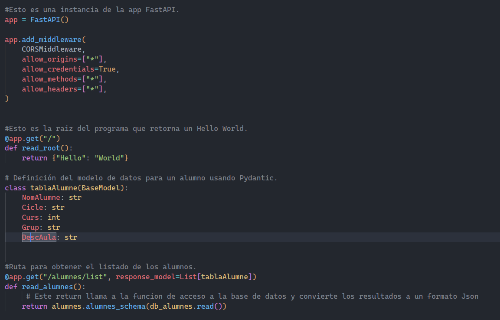
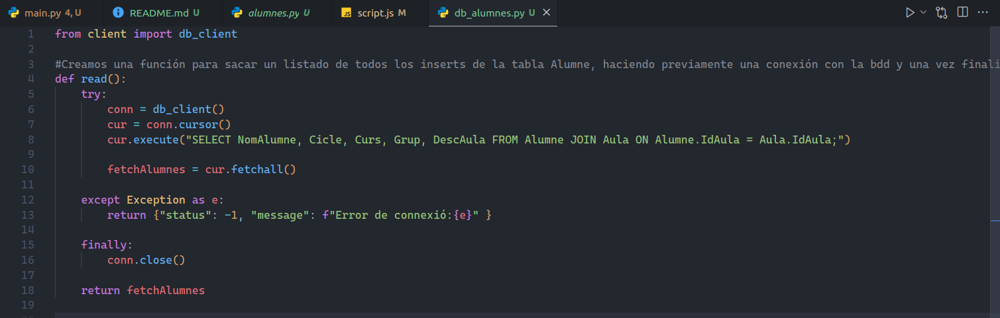
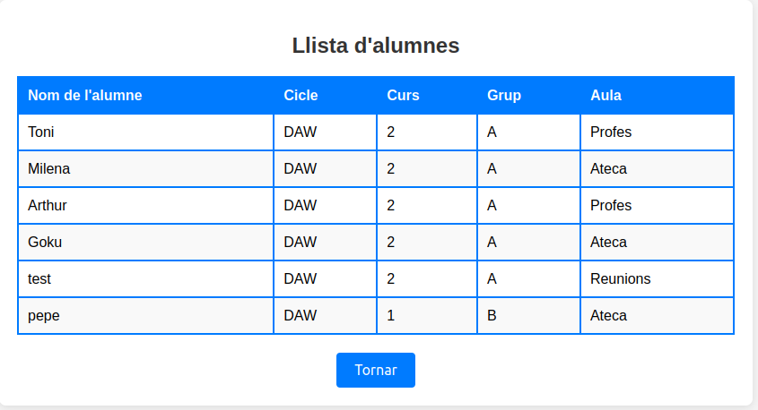

### APARTADO 1: Llamada a la API desde la WEB.
> [!NOTE]
> ARCHIVO: main.py

## CODIGO:    

    - Lo que hemos añadido aqui básicamente ha sido el codigo siguiente:
        - from fastapi.middleware.cors import CORSMiddleware
            - Explicación: Lo que conseguimos con la linea anterior es incorporar el middleware CORSMiddleware en nuestra APP de FastAPI.

> [!NOTE]
> ARCHIVO: alumnes.py

## CODIGO:

    - Los cambios que hemos hecho en esta "lista" han sido quitar los campos antiguos que no los necesitabamos y dejar/añadir los si.
        - Explicación: Basicamente lo que conseguimos con esto es mostrarlo en un formato JSON.

> [!NOTE]
> ARCHIVO: db_alumnes.py

    - Explicación: Aqui lo único que hemos hecho es cambiar la query por la actual, ya que necesitabamos acceder a otro campo de la tabla Aula usando el JOIN.

## EJECUCION WEB APARTADO 1:

