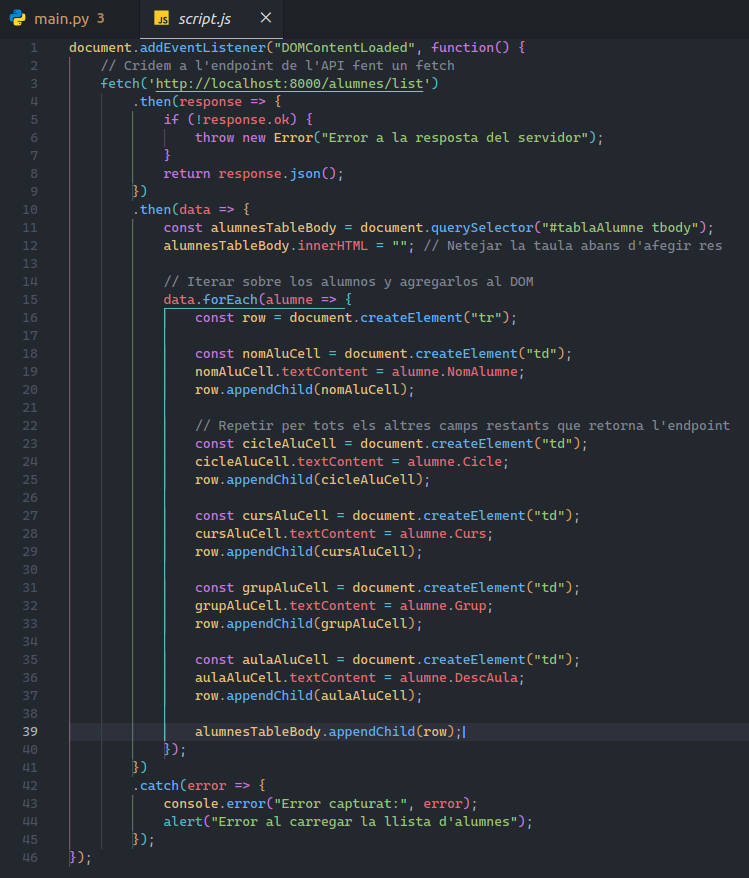
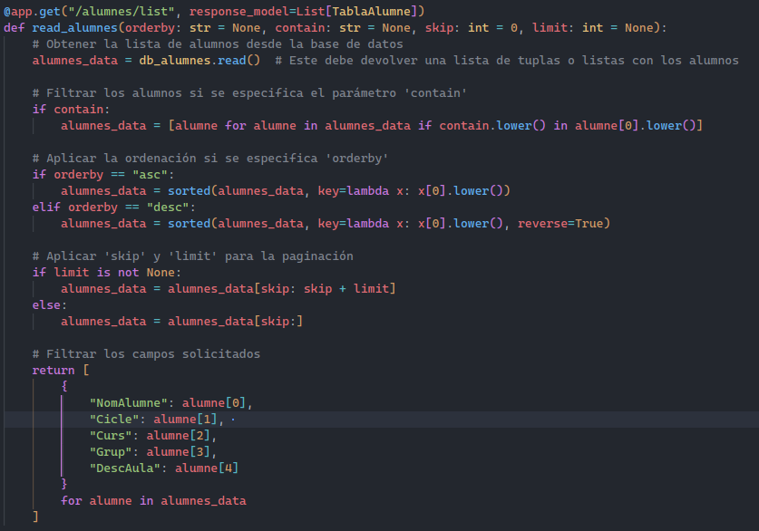
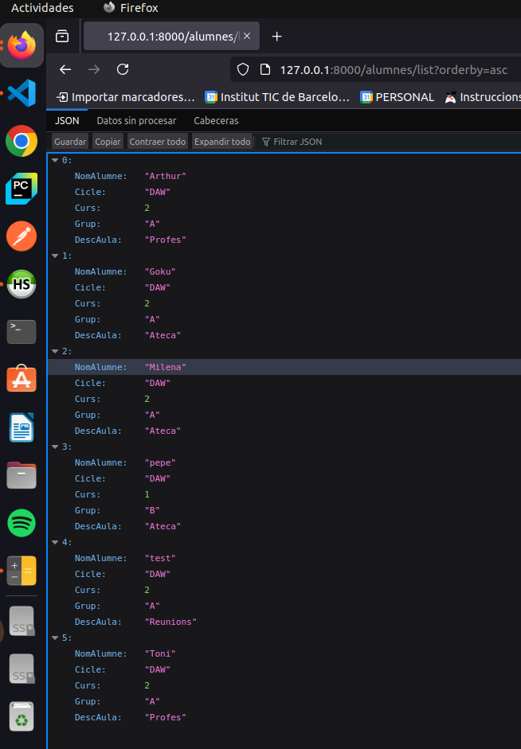
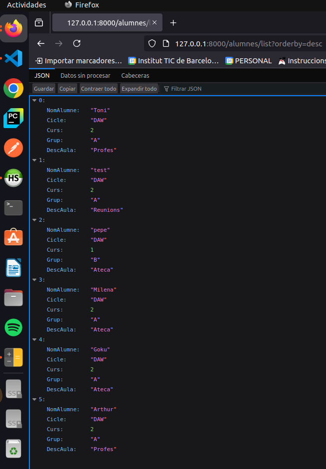
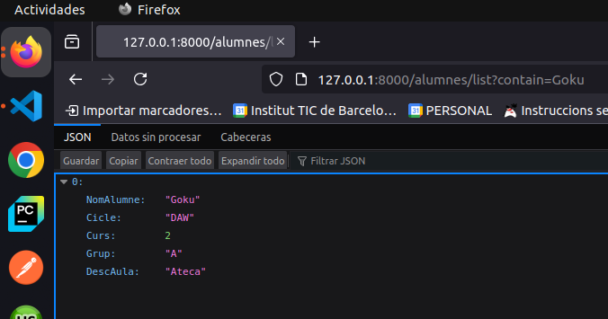
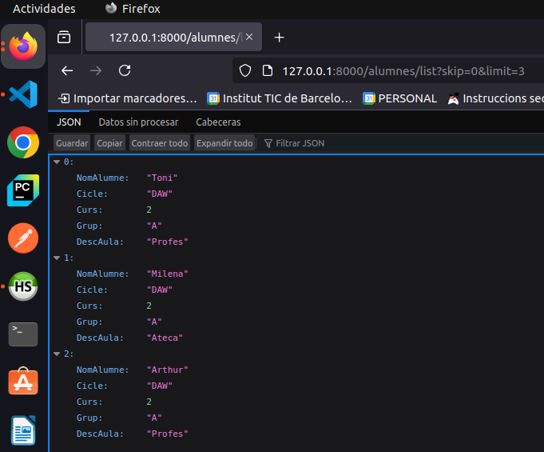
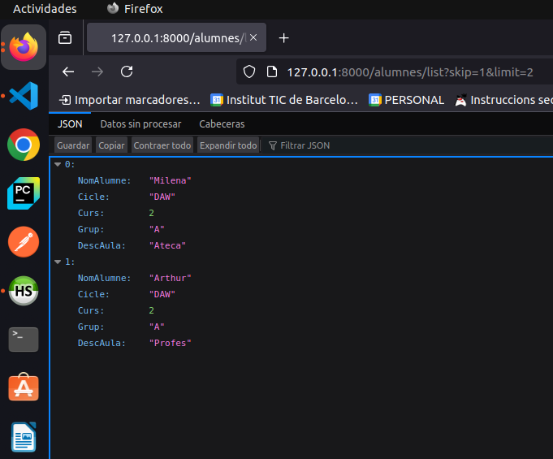
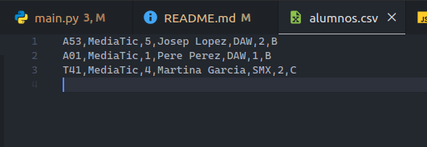
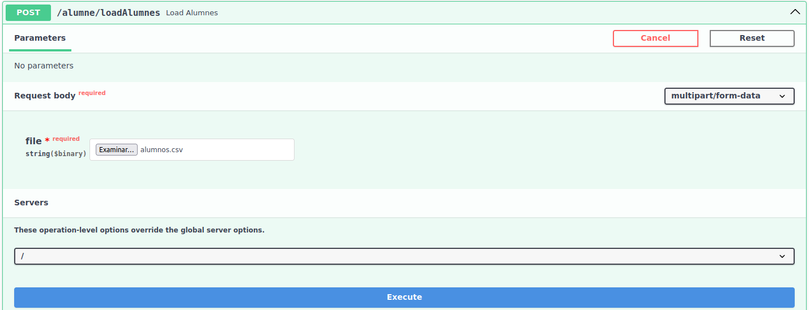
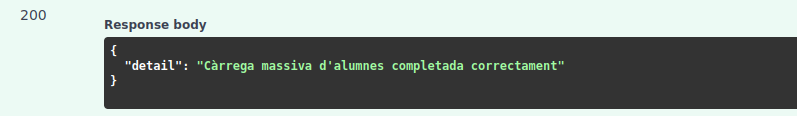

### APARTADO 1: Llamada a la API desde la WEB.
> [!NOTE]
> ARCHIVO: main.py

## CODIGO:    

    - Lo que hemos añadido aqui básicamente ha sido el codigo siguiente:
        - from fastapi.middleware.cors import CORSMiddleware
            - Explicación: Lo que conseguimos con la linea anterior es incorporar el middleware CORSMiddleware en nuestra APP de FastAPI.

> [!NOTE]
> ARCHIVO: alumnes.py

## CODIGO:

    - Los cambios que hemos hecho en esta "lista" han sido quitar los campos antiguos que no los necesitabamos y dejar/añadir los si.
        - Explicación: Basicamente lo que conseguimos con esto es mostrarlo en un formato JSON.

> [!NOTE]
> ARCHIVO: db_alumnes.py

    - Explicación: Aqui lo único que hemos hecho es cambiar la query por la actual, ya que necesitabamos acceder a otro campo de la tabla Aula usando el JOIN.

> [!NOTE]
> ARCHIVO: script.js

    -Explicación: Lo que hacemos es añadir el codigo que habia de base pero moficiando por cada columna segun lo tengamos en nuestra bdd para que luego recoja los valores en la tabla de forma correcta.

## EJECUCION WEB APARTADO 1:

### APARTADO 2: Consultas avanzadas.

> [!NOTE]
> ARCHIVO: main.py

    -Explicación: Lo que hacemos es definir nuestro endpoint que nos devolverá el listado de alumnos pasandole por parametros el 1- order by: (que nos ordenará los resultados de manera ascendente o descendente, segun le indiquemos.) 2- contain: (Que filtrará el alumno que le especifiquemos) 3- skip: Nos permitirá omitir un numero especifico de resultados y por ultimo limit: como su propio nombre indica nos limitará el numero de resultados de la propia respuesta.

    -Obtenemos los datos de nuestra funcion db_alumnes.read().

## EJECUCIÓNES DEL CODIGO:

> [!NOTE]
> Orden de alumnos: Ascendente/Descendente

> [!NOTE]
> Filtrado por nombre:

> [!NOTE]
> skip y limit:

### APARTADO 3: Carga masiva de alumnos.

## PROCESO DE EJECUCION.
> [!IMPORTANT]
> Hay que instalar lo siguiente para poder ejecutar este tipo de tareas: pip install python-multipart

    - Primero creamos nuestro documento csv y introducimos los datos.

    - Luego iremos a nuestro path: 127:0.0.1:8000/docs

    - Una vez cargado le daremos a execute y si todo funciona OK deberia salir lo siguiente:

    - Si todo sale OK nos devolverá un STATUS 200.

    

